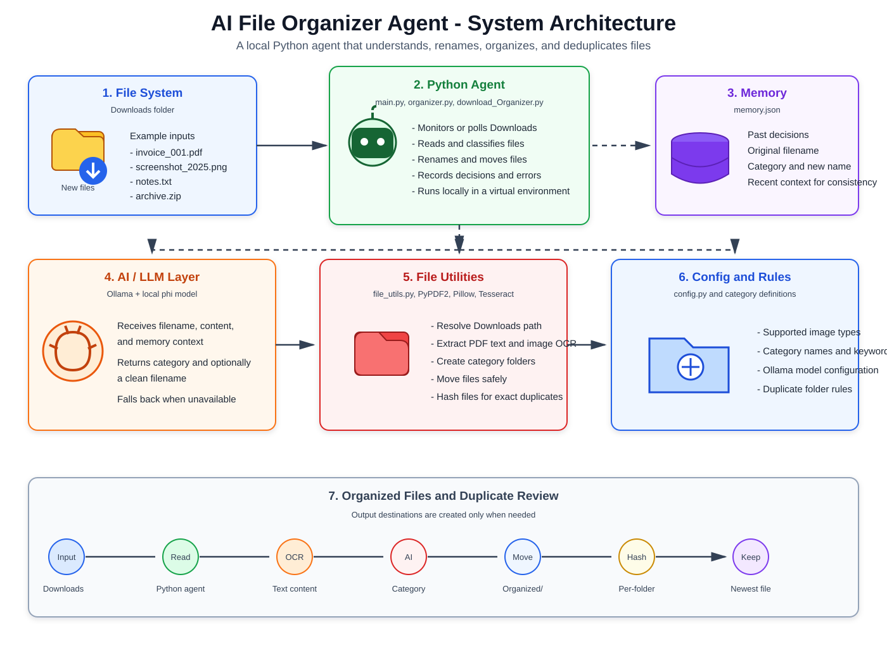
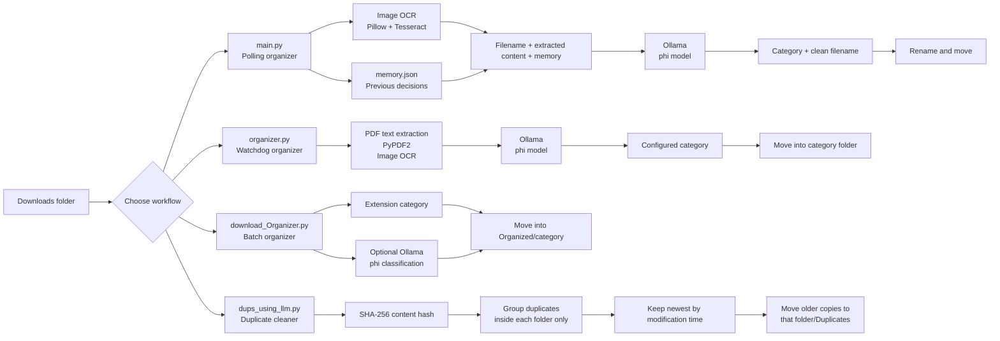

# AI File Organizer

A local Python toolkit for organizing a Downloads folder with Ollama, OCR, PDF text extraction, file hashing, and configurable category rules. Files stay on the local machine; the project does not upload file contents to a cloud service.

## Architecture



The static diagram above is the rendered architecture reference. The Mermaid diagram below remains editable and shows the same data flow in a GitHub-native format.



## Features

- Local AI categorization through the Ollama HTTP API and the `phi` model.
- Content-aware processing for images and PDFs.
- OCR for PNG, JPG, JPEG, TIFF, BMP, and GIF files through Tesseract.
- Persistent decision history in `memory.json` for the polling workflow.
- Extension-based fallback when Ollama is unavailable or returns an invalid category.
- Watchdog-based monitoring for newly created files.
- Batch organization with collision-safe destination names.
- Exact duplicate detection using SHA-256 hashes.
- Per-folder duplicate handling: the newest file is kept and older copies move to a local `Duplicates` folder.
- No automatic deletion of duplicate files.

## Project Files

| File | Purpose |
| --- | --- |
| `main.py` | Polls Downloads every 60 seconds, analyzes files, renames them, and moves them into categories. |
| `organizer.py` | Watches for new files with `watchdog`, extracts PDF/image content, and moves files into configured categories. |
| `download_Organizer.py` | Performs a one-time batch organization using Ollama with extension-based fallback. |
| `dups_using_llm.py` | Recursively finds exact duplicates within each folder, keeps the newest, and moves older copies to `Duplicates`. Despite its historical name, duplicate decisions use hashing rather than an LLM. |
| `Check_duplicates.py` | Standalone exact-duplicate checker that moves duplicates to `marked_for_delete_folder`. |
| `Ai_utils.py` | Ollama request, memory loading/saving, prompt creation, and response parsing for `main.py`. |
| `file_utils.py` | Downloads path, file discovery, image OCR, and file movement helpers. |
| `config.py` | Supported image extensions for the polling workflow. |
| `requirements.txt` | Python dependencies. |
| `.gitignore` | Excludes virtual environments, logs, caches, generated folders, and local memory. |

## Requirements

- Windows, macOS, or Linux. The checked-in default path is currently Windows: `C:\Users\pavan\Downloads`.
- Python 3.10 or newer is recommended.
- Ollama installed and running locally.
- The Ollama `phi` model pulled locally.
- Tesseract OCR installed and available on `PATH` when image OCR is required.

For macOS or Linux, update `get_downloads_path()` in `file_utils.py` to return the appropriate Downloads directory before running the scripts.

## Installation

### Windows PowerShell

```powershell
git clone https://github.com/vinaykadiyam/AI-files-Organiser.git
Set-Location AI-files-Organiser

py -m venv venv
Set-ExecutionPolicy -Scope Process -ExecutionPolicy RemoteSigned
.\venv\Scripts\Activate.ps1
python -m pip install --upgrade pip
python -m pip install -r requirements.txt
```

Install Tesseract separately, then verify that the `tesseract` command is available in PowerShell.

### macOS/Linux

```bash
git clone https://github.com/vinaykadiyam/AI-files-Organiser.git
cd AI-files-Organiser

python3 -m venv venv
source venv/bin/activate
python -m pip install --upgrade pip
python -m pip install -r requirements.txt
```

Install Tesseract with the package manager for your operating system. On macOS with Homebrew:

```bash
brew install tesseract
```

## Ollama Setup

Install Ollama from [ollama.com](https://ollama.com/), start the local service, and pull the model used by this project:

```powershell
ollama serve
ollama pull phi
ollama list
```

The service listens at `http://localhost:11434` by default. Verify it with:

```powershell
Invoke-WebRequest http://localhost:11434/api/tags -UseBasicParsing
```

## Running the Organizers

Run commands from the project directory with the virtual environment activated.

### Watch for New Files

`organizer.py` uses `watchdog` and reacts when a new file appears in Downloads. It extracts PDF text or image OCR text, asks Ollama for a category, then moves the file into a category directory.

```powershell
python organizer.py
```

Press `Ctrl+C` to stop it. This watcher uses the categories defined in `organizer.py` and does not recursively watch files already inside category folders.

### Polling Organizer with Rename and Memory

`main.py` checks Downloads every 60 seconds. It sends the filename, image OCR content, and recent decisions from `memory.json` to Ollama. The response can provide both a category and a clean filename.

```powershell
python main.py
```

This workflow can rename files before moving them. Keep `memory.json` local because it may contain filenames and category history.

### One-Time Batch Organizer

`download_Organizer.py` scans the current files in Downloads once and creates an `Organized` directory with category subfolders.

```powershell
python download_Organizer.py
```

It uses Ollama for categorization and falls back to extension-based categories such as `Images`, `Documents`, `Videos`, `Archives`, and `Others`. Existing destination files receive a timestamped name instead of being overwritten.

### Duplicate Cleaner

`dups_using_llm.py` recursively scans every folder under Downloads. Within each individual folder, it hashes files with SHA-256, keeps the newest file in each identical-content group, and moves older copies to:

```text
<source folder>/Duplicates/
```

The cleaner skips all `Duplicates` folders on future scans and never deletes files automatically.

```powershell
python dups_using_llm.py
```

This operation changes the filesystem. Review the output before running it on important data.

## Categories and Customization

For the watchdog workflow, edit `CATEGORIES` in `organizer.py`:

```python
CATEGORIES = {
	"Invoices": "invoice, receipt, bill, payment",
	"Images": "image, picture, screenshot, photo",
	"Documents": "document, report, resume, letter, form",
	"Code": "python, javascript, html, css, script",
	"Personal": "personal, travel, health, finance",
	"Work": "work, project, meeting, presentation",
}
```

For the polling workflow, the category and filename response is parsed in `Ai_utils.py`. For the batch workflow, extension categories are defined in `download_Organizer.py`.

To use another Ollama model, pull it first and change the `model` value in the relevant script. The default project configuration uses `phi`:

```python
response = ollama.chat(
	model="phi",
	messages=[{"role": "user", "content": prompt}],
)
```

## Safety and Operational Notes

- Test with a temporary folder before processing a large Downloads directory.
- The organizer scripts move files; they do not create backups.
- `dups_using_llm.py` keeps the newest file based on modification time, not filename or creation time.
- Exact duplicate detection compares file bytes. Similar-looking or semantically similar documents are not treated as duplicates.
- Files that Ollama cannot classify use a fallback category, depending on the workflow.
- Image OCR requires both the Python `pytesseract` package and the native Tesseract executable.
- Do not run multiple organizer processes against the same folder at the same time.
- Generated logs, virtual environments, `memory.json`, and generated organization folders are excluded by `.gitignore`.

## Troubleshooting

### Ollama connection refused

Start Ollama and verify `http://localhost:11434/api/tags` responds. Confirm that the requested model is installed with `ollama list`.

### Model not found

Pull the configured model:

```powershell
ollama pull phi
```

### OCR does not work

Verify Tesseract is installed and available on `PATH`. On Windows, restart the terminal after installing Tesseract if the command is not recognized.

### Files are not being found

Confirm the path returned by `get_downloads_path()` in `file_utils.py`. The default path is `C:\Users\pavan\Downloads`.

### Validate the Python files

```powershell
python -m py_compile Ai_utils.py Check_duplicates.py config.py download_Organizer.py dups_using_llm.py file_utils.py main.py organizer.py
```

## Privacy

The project is designed for local processing. File contents are sent only to the Ollama service running on the local machine. Review prompts, logs, and `memory.json` before sharing project output publicly.

## License

No license file is currently included. Add a `LICENSE` file before distributing this project or accepting external contributions.

## Acknowledgments

- [Ollama](https://ollama.com/)
- [Watchdog](https://github.com/gorakhargosh/watchdog)
- [PyPDF2](https://pypi.org/project/PyPDF2/)
- [Pillow](https://python-pillow.org/)
- [pytesseract](https://github.com/madmaze/pytesseract)
- [Tesseract OCR](https://github.com/tesseract-ocr/tesseract)
